```mermaid
flowchart TD
    A[🔍 VulnerabilityReport<br/>Found] --> B{Already<br/>Patched?}
    B -->|Yes| C[Skip]
    B -->|No| D

    subgraph D[" "]
        direction TB
        D0[🛠️ <b>Patch Image with Copa</b>]
        D1[1. Setup BuildKit if needed]
        D2[2. Run copa patch]
        D3[3. Push the patched image to Registry]
        D0 --- D1 --> D2 --> D3
    end

    D --> H[Create PatchJob<br/>Mark Complete]
```

# vuln-patcher

## Problem
[sbomscanner](https://github.com/kubewarden/sbomscanner) is able to discover vulnerabilities, user usually found the result confusing, and not easy to patch it. [copa](https://github.com/project-copacetic/copacetic) a cli to patch the containers tool may help it, but it does not implement in the k8s env.

This project will create a controller to watch the sbomscanner's vulnerability cr and create a patch image and upload to the registry.

## Workflow

## Workflow
1. **Controller watches VulnerabilityReport CRs**: The `PatchJobReconciler` watches for `VulnerabilityReport` CRs using Kubernetes controller-runtime's watch mechanism.
   - When a `VulnerabilityReport` is created or updated, it triggers a reconcile request for the corresponding `PatchJob`.

2. **Filter already-patched images**: The controller filters out images that have already been patched by checking if the image tag contains the patch suffix (e.g., `-patch`).

3. **Prepare BuildKit infrastructure** (if `PatchJob` doesn't exist):
   - Create a `BuildkitTemplate` CR with BuildKit configuration (image, port, registry settings).
   - Create a `Buildkit` CR that references the template (managed by BuildKit operator).
   - Create a Kubernetes `Service` with selector matching BuildKit operator's Pod labels (`app.kubernetes.io/name=buildkit`).
   - The BuildKit operator automatically creates a Pod based on the `Buildkit` CR.

4. **Transform and patch** (if `PatchJob` doesn't exist):
   - Transform the `VulnerabilityReport` format (sbomscanner format) to Trivy JSON format that `copa` expects.
   - Write the transformed report to a temporary file.
   - Execute `copa patch` CLI command within the controller Pod:
     - Connects to BuildKit via the Service (e.g., `tcp://dev.default.svc.cluster.local:1234`).
     - Uses the vulnerability report to patch the container image.
     - Pushes the patched image to the registry with a new tag (original tag + `-patch` suffix).

5. **Create PatchJob CR**: After successful patching, create a `PatchJob` CR to track that the patching operation has been completed.
   - The `PatchJob` CR shares the same name and namespace as the `VulnerabilityReport`.
   - If patching fails, the `PatchJob` is not created, allowing the controller to retry on the next reconcile.

6. **Skip if already processed**: If a `PatchJob` CR already exists for a `VulnerabilityReport`, the controller skips processing to avoid duplicate patching.

### How to reconcile the vulnerability changes?
- The controller uses a 1:1 mapping between `VulnerabilityReport` and `PatchJob` (same name/namespace).
- When a `VulnerabilityReport` changes, it triggers a reconcile for the corresponding `PatchJob`.
- The controller checks if a `PatchJob` exists:
  - If not, it processes the patch and creates the `PatchJob`.
  - If exists, it skips processing (current implementation) or could check for updates in future versions.

## Limitation
- Only builds and pushes patched images; it does **not** automatically update Deployments/Pods to use the new image (at least in the first version).
- Depends on `sbomscanner` `VulnerabilityReport` CRs and their timer-based rescan behavior; we treat those CRs as read-only input and track patch state separately via `PatchJob` CRD.
- Uses `copa` as an external CLI tool (via `os/exec`), there is no stable Go API integration yet.
- Scope is limited to images referenced by the vulnerability CRs; it does not scan or discover images by itself, and re-patching decisions are based on whether a `PatchJob` exists.
- Patching is performed synchronously within the controller Pod, which may block reconciliation if patching takes a long time.

## Implementation limitation
- no TLS between pod and buildkit
- IgnoreError: true, // Ignore errors if packages are not available in repos
- Pull and operate with public registry
- Use root for patching
- Use copa cli not lib, because the conflict issue with docker
- Does not support sbomscanner report format directly
   - manually transforms sbomscanner format to Trivy format
- currently can not scale (patching happens synchronously in controller)
- BuildKit is created per registry (based on `VulnerabilityReport.ImageMetadata.Registry`)

## Status
The initial version (v1) of `vuln-patcher` is complete with the following features:
- Successfully integrates with `sbomscanner` to scan container images for vulnerabilities.
- Automatically triggers `PatchJob` to patch vulnerable images and push the patched images to the configured registry.
- Provides a functional workflow to manage vulnerabilities and generate patched images in a Kubernetes environment.
- BuildKit is automatically generated when needed using BuildKit operator.
- Filters out already-patched images to avoid duplicate processing.

This version establishes the foundation for automated vulnerability patching in Kubernetes, focusing on core functionality and integration.

## Future work
- Add queue to decouple the computing and reconciling (e.g., using NATS or Kubernetes Job queue).
- Add retry mechanism like how scanjob is implemented in [sbomscanner](https://github.com/kubewarden/sbomscanner).
- Add status tracking in `PatchJob` CRD to show patch progress and results.
- Support for re-patching when `VulnerabilityReport` is updated with new vulnerabilities.
- Scale patching operations by using Kubernetes Jobs instead of running in controller Pod.

## Reference
- [kubescape](https://kubescape.io/) uses a CLI-based approach to patch images, not Kubernetes CRs.
   - It uses `BuildKit` as a service, so many `kubescape` commands can share the same `BuildKit` instance.